# Noise data
18 types of noise are used to form the EMGSE test set. 12 of them are speech noises and the rest are nonspeech noises. 

## Speech noise
Speech noises are collected from Chinese and English speakers.

Noise type| Audio file (Chinese)| Audio file(English)|
--------------|------| -----|
1 female talker |<audio src="noise/Chinese speech noise/one_female_chinese.wav" controls="" preload=""></audio> |<audio src="noise/English speech noise/one_female_english.wav" controls="" preload=""></audio>|
1 male talker |<audio src="noise/Chinese speech noise/one_male_chinese.wav" controls="" preload=""></audio>|<audio src="noise/English speech noise/one_male_english.wav" controls="" preload=""></audio>|
1 female and 1 male talkers  |<audio src="noise/Chinese speech noise/one_female_one_male_chinese.wav" controls="" preload=""></audio>|<audio src="noise/English speech noise/one_female_one_male_english.wav" controls="" preload=""></audio>|
2 female talkers  |<audio src="noise/Chinese speech noise/two_female_chinese.wav" controls="" preload=""></audio>|<audio src="noise/English speech noise/two_female_english.wav" controls="" preload=""></audio>|
2 male talkers  |<audio src="noise/Chinese speech noise/two_female_chinese.wav" controls="" preload=""></audio>|<audio src="noise/English speech noise/two_female_english.wav" controls="" preload=""></audio>|
2 male and 1 female talkers  |<audio src="noise/Chinese speech noise/two_male_one_female_chinese.wav" controls="" preload=""></audio>|<audio src="noise/English speech noise/two_male_one_female_english.wav" controls="" preload=""></audio>|
 
## Nonspeech noise

Noise type| Audio file|
--------------|-----| 
Car noise|<audio src="noise/car noise.wav" controls="" preload=""></audio> |   
Pink noise|<audio src="noise/pink noise.wav" controls="" preload=""></audio>|
White noise|<audio src="noise/white noise.wav" controls="" preload=""></audio>|
Engine noise|<audio src="noise/engine noise.wav" controls="" preload=""></audio>|
Street noise (1)|<audio src="noise/street noise(1).wav" controls="" preload=""></audio>|
Street noise (2)|<audio src="noise/street noise(2).wav" controls="" preload=""></audio>|

# Experimental Results 

## SE Performance of EMGSE and SE(A)

Utterance 40  : "The senator said goodbye to republicans on capital hill today."

Speaker       : number 5, male

Noise type    : 2 English male talkers (speech noise)

Source|  SNR -11dB| SNR 4dB|
--------------|-----|-----|
Ground truth |<audio src="wavfile/utter21/Spk5_Block1-Initial_0021_clean.wav" controls="" preload=""></audio>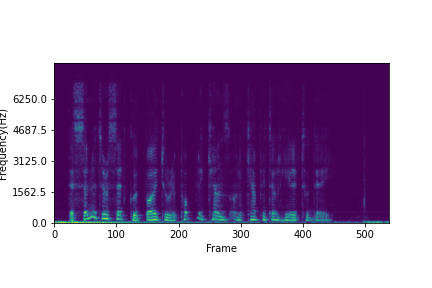|<audio src="wavfile/utter21/Spk5_Block1-Initial_0021_clean.wav" controls="" preload=""></audio>|
Noisy |<audio src="wavfile/utter21/2maleEnglish/Spk5_Block1-Initial_0021_2maleEng_-11.wav" controls="" preload=""></audio>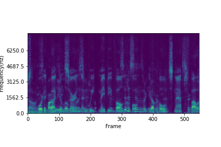|<audio src="wavfile/utter21/2maleEnglish/Spk5_Block1-Initial_0021_2maleEng_4.wav" controls="" preload=""></audio>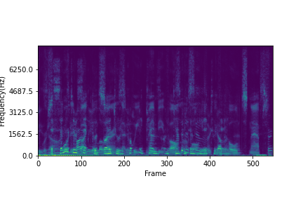|
Enhanced(SE(A))|<audio src="wavfile/utter21/2maleEnglish/Spk5_Block1-Initial_0021_enh_base_2maleEng_-11.wav" controls="" preload=""></audio>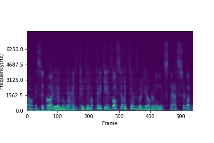|<audio src="wavfile/utter21/2maleEnglish/Spk5_Block1-Initial_0021_enh_base_2maleEng_4.wav" controls="" preload=""></audio>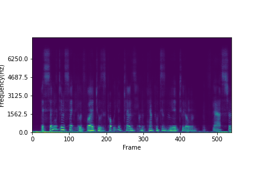|
Enhanced(EMGSE)|<audio src="wavfile/utter21/2maleEnglish/Spk5_Block1-Initial_0021_enh_emgse_2maleEng_-11.wav" controls="" preload=""></audio>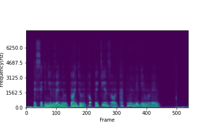|<audio src="wavfile/utter21/2maleEnglish/Spk5_Block1-Initial_0021_enh_emgse_2maleEng_4.wav" controls="" preload=""></audio>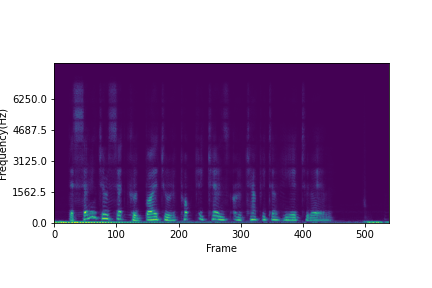|
Enhanced(EMGSEcheek)|<audio src="wavfile/utter21/2maleEnglish/Spk5_Block1-Initial_0021_enh_emgse28_2maleEng_-11.wav" controls="" preload=""></audio>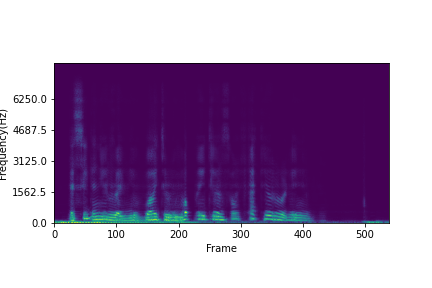|<audio src="wavfile/utter21/2maleEnglish/Spk5_Block1-Initial_0021_enh_emgse28_2maleEng_4.wav" controls="" preload=""></audio>|

Utterance 40 : "You can see the rain curtains are wrapping."

Speaker      : number 5, male

Noise type   : Street noise (2) (nonspeech noise)

   Source      |      SNR -11dB     |       SNR 4dB     |
--------------|-----|-----|
Ground truth |<audio src="wavfile/utter40/Spk5_Block1-Initial_0040.wav" controls="" preload=""></audio>|<audio src="wavfile/utter40/Spk5_Block1-Initial_0040.wav" controls="" preload=""></audio>|
Noisy |<audio src="wavfile/utter40/street/Noisy/Spk5_Block1-Initial_0040_street_-11.wav" controls="" preload=""></audio>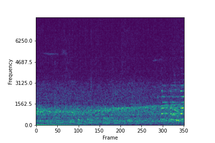|<audio src="wavfile/utter40/street/Noisy/Spk5_Block1-Initial_0040_street_4.wav" controls="" preload="" ></audio>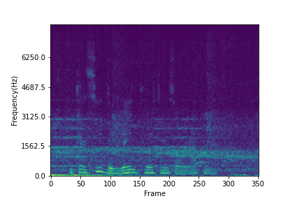|
Enhanced(SE(A))|<audio src="wavfile/utter40/street/baseline/Spk5_Block1-Initial_0040_enh_base_street_-11.wav" controls="" preload=""></audio>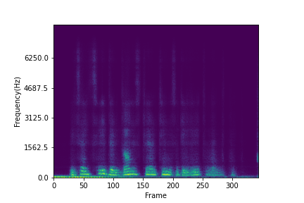|<audio src="wavfile/utter40/street/baseline/Spk5_Block1-Initial_0040_enh_base_street_4.wav" controls="" preload=""></audio>|
Enhanced(EMGSE)|<audio src="wavfile/utter40/street/EMGSE/Spk5_Block1-Initial_0040_enh_emgse_street_-11.wav" controls="" preload=""></audio>|<audio src="wavfile/utter40/street/EMGSE/Spk5_Block1-Initial_0040_enh_emgse_street_4.wav" controls="" preload=""></audio>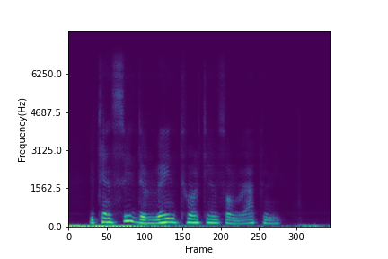|
Enhanced(EMGSEcheek)|<audio src="wavfile/utter40/street/EMGSE28/Spk5_Block1-Initial_0040_enh_emgse28_street_-11.wav" controls="" preload=""></audio>|<audio src="wavfile/utter40/street/EMGSE28/Spk5_Block1-Initial_0040_enh_emgse28_street_4.wav" controls="" preload=""></audio>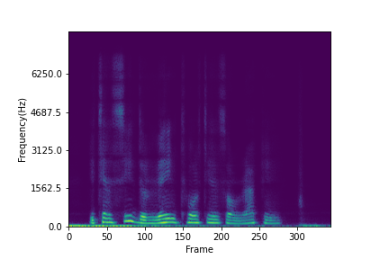|

 

 

