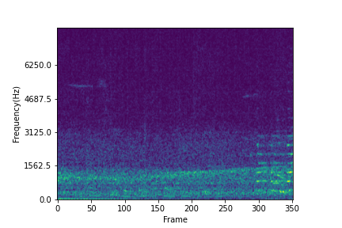

# Noise data
13 types of noise are used to create EMGSE testing data. 7 of them are speech noise and the rest are nonspeech noise. 

## Speech noise
Speech noise with Mandarine and English is used.
### English talkers

Noise type| Audio file|
--------------|------| 
1 female talker |<audio src="Noise/F_1talker.wav" controls="" preload=""></audio> |
1 male talker |<audio src="Noise/M_1talker.wav" controls="" preload=""></audio>|
1 male and 1 female talker  |<audio src="Noise/1M1F_2talkers.wav" controls="" preload=""></audio>|
2 female talkers  |<audio src="Noise/F_2talkers.wav" controls="" preload=""></audio>|
2 male talkers  |<audio src="Noise/M_2talkers.wav" controls="" preload=""></audio>|
 

### Taiwanese talkers 

Noise type| Audio file|
------------|--------| 
2 male talkers | <audio src="Noise/Taiwanese_M_2talkers.wav" controls="" preload=""></audio> |
2 male and 1 female talker | <audio src = "Noise/Taiwanese_2M1F_3talkers.wav" controls="" preload=""></audio>|

## Nonspeech noise

Noise type| Audio file|
--------------|-----| 
Car|<audio src="Noise/car noise.wav" controls="" preload=""></audio> |   
Engine|<audio src="Noise/engine noise.wav" controls="" preload=""></audio>|
Pink|<audio src="Noise/pink noise.wav" controls="" preload=""></audio>|
White|<audio src="Noise/white noise.wav" controls="" preload=""></audio>|
Street noise (1)|<audio src="Noise/street noise(1).wav" controls="" preload=""></audio>|
Street noise (2)|<audio src="Noise/street noise(2).wav" controls="" preload=""></audio>|

# Experimental Results 

## SE Performance of EMGSE and baseline

Utterance 40  : "You can see the rain curtains are wrapping."

Speaker       : number 5, male

Noise type    : 1 English male talker (speech noise)

Source|  SNR -11dB| SNR 4dB|
--------------|-----|-----|
Ground truth |<audio src="Noise/car noise.wav" controls="" preload=""></audio>|<audio src="Noise/car noise.wav" controls="" preload=""></audio>|
Noisy |
Enhanced(Baseline)|
Enhanced(EMGSE)|
Enhanced(EMGSE 28ch)|

Utterance 40 : "You can see the rain curtains are wrapping."

Speaker      : number 5, male

Noise type   : Street noise (2) (nonspeech noise)

   Source      |      SNR -11dB     |       SNR 4dB     |
--------------|-----|-----|
Ground truth |<audio src="wavfile/utter40/Spk5_Block1-Initial_0040.wav" controls="" preload=""></audio>|<audio src="wavfile/utter40/Spk5_Block1-Initial_0040.wav" controls="" preload=""></audio>|
Noisy |<audio src="wavfile/utter40/street/Noisy/Spk5_Block1-Initial_0040_street_-11.wav" controls="" preload=""></audio>|<audio src="wavfile/utter40/street/Noisy/Spk5_Block1-Initial_0040_street_4.wav" controls="" preload=""></audio>|
Enhanced(Baseline)|<audio src="wavfile/utter40/street/baseline/Spk5_Block1-Initial_0040_enh_base_street_-11.wav" controls="" preload=""></audio>|<audio src="wavfile/utter40/street/baseline/Spk5_Block1-Initial_0040_enh_base_street_4.wav" controls="" preload=""></audio>|
Enhanced(EMGSE)|<audio src="wavfile/utter40/street/EMGSE/Spk5_Block1-Initial_0040_enh_emgse_street_-11.wav" controls="" preload=""></audio>|<audio src="wavfile/utter40/street/EMGSE/Spk5_Block1-Initial_0040_enh_emgse_street_-11.png" controls="" preload=""></audio>|
Enhanced(EMGSE 28ch)|<audio src="wavfile/utter40/street/EMGSE28/Spk5_Block1-Initial_0040_enh_emgse28_street_-11.wav" controls="" preload=""></audio>|<audio src="wavfile/utter40/street/EMGSE28/Spk5_Block1-Initial_0040_enh_emgse28_street_4.wav" controls="" preload=""></audio>|

## The phenomenon of missing syllables in EMGSE

Noise type : Car noise
Utterance 19: "You can see the rain curtains are wrapping."
Utterance 29: "You can see the rain curtains are wrapping."

Source| Utterance 19| Utterance 29|
--------------|-----|-----|
Ground truth|
Noisy|
Enhanced(Baseline)|
Enhanced(EMGSE)|

 

 

